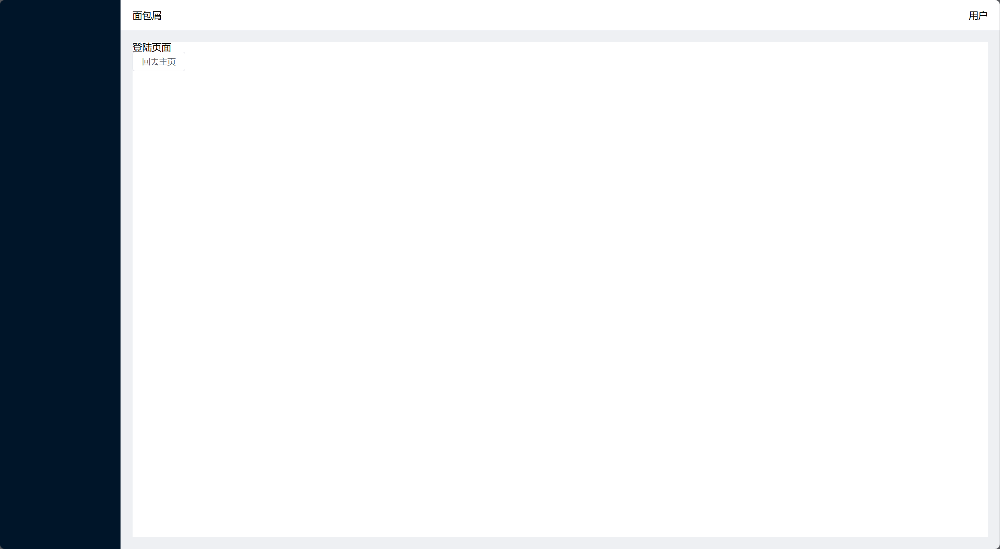

# Deploy Your Own

Deploy your own Vite project with Vercel.

[](https://vercel.com/new/clone?repository-url=https://github.com/vercel/vercel/tree/main/examples/vite&template=vite)

_Live Example: https://vite-vue-template.vercel.app_

## Deploying From Your Terminal

You can deploy your new Vite project with a single command from your terminal using [Vercel CLI](https://vercel.com/download):

```shell
$ vercel
```

## 前期展示



## 启动

```shell
bun run dev
```

---

## Vue3 管理系统开发

> 前置要求：
>
> 项目采用 `bun` 而不采用 `npm` | 兼容所有 node 的配置
>
> [Bun 官网](https://bun.sh)

## 安装依赖

```shell
bun i -g @vue-cli
```

### 创建项目

```shell
# vue 脚手架创建
bun create vue manager-fe
# vite 创建
bun i -g vite@latest
```

### 安装插件

```shell
# 生产环境
bun i vue-router@next element-plus axios -D
# 开发环境
bun i sass -S
```

### 路由搭建

#### Composition API 跳转

```vue
<script setup>
import { useRouter } from 'vue-router'
let router = useRouter()
const goHome = () => {
  router.push('/welcome')
}
</script>
```

#### 传统跳转

```vue
<template>
  <h1>登陆页面</h1>
  <el-button @click="goHome">回去主页</el-button>
</template>

<script>
export default {
  name: 'welcome',
  methods: {
    goHome() {
      this.$router.push('/welcome')
    },
  },
}
</script>
```
